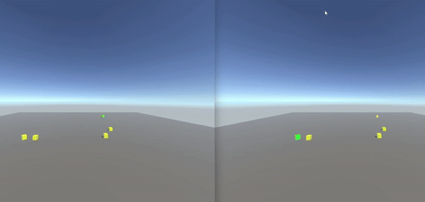

# Unity Client Side Physics Prediction using Riptide Networking

<p align="center">
  
</p>

# Purpose

Implement the client side prediction logic from: https://www.codersblock.org/blog/client-side-prediction-in-unity-2018 using the [Riptide networking library](https://github.com/RiptideNetworking/Riptide).

# Installation and Getting Started

Unity version: 2022.3.39f1 (LTS)

Clone or download this repository. Inside you will find two main folders, Client and Server. Use Unity Hub to add these two projects, they need to be opened separately. Once added and opened, head over to the scenes folder in both projects and open the scene named “Main”. You should now be able to start the server and start the client. On the client project you will be presented with a “username” text field and a “connect” button. Hitting connect or pressing enter will connect you to the local server (a username is not required). You can now use WASD and space to move the cube.

# Theory

### Authoritative Server

There are a few different reasons one might choose an authoritative server architecture. The most popular reason is to prevent client side cheating. The issue you’ll quickly find with authoritative servers is input delay. You must wait a round trip from client to server for your input to be processed. The client acts a dumb terminal processing inputs while the server runs the actual game.

<p align="center">
  
</p>

### Client Side Prediction

The solution is having the client move right away and store the location in a buffer. When the client receives a server position it compares it to the buffer. If the position is too far off, move the client to the server position.

<p align="center">
  
</p>

# Server and Client

Disable physics. We will be progressing physics at our own rate.

```cs
Physics.simulationMode = SimulationMode.Script;
```

The physics timestep per tick. It is important for the server and client to be on the same time scale. aka set the same “Fixed Timestep” value under Edit->Project Settings...->Time

```cs
deltaTickTime = Time.fixedDeltaTime;
```

```cs
private void PhysicsStep(Rigidbody rigidbody, bool[] inputs)
{
    if (inputs[0])
    {
        rigidbody.AddForce(Vector3.forward * player_movement_impulse, ForceMode.Impulse);
    }
    if (inputs[1])
    {
        rigidbody.AddForce(-Vector3.forward * player_movement_impulse, ForceMode.Impulse);
    }
    if (inputs[2])
    {
        rigidbody.AddForce(-Vector3.right * player_movement_impulse, ForceMode.Impulse);
    }
    if (inputs[3])
    {
        rigidbody.AddForce(Vector3.right * player_movement_impulse, ForceMode.Impulse);
    }
    if (rigidbody.transform.position.y <= player_jump_y_threshold && inputs[4])
    {
        rigidbody.AddForce(Vector3.up * player_movement_impulse, ForceMode.Impulse);
    }
}
```

Simple rigidbody movement. Both the server and client share the same code and values.

### Buffers

```cs
public class ClientInput
{
    public bool[] Inputs = new bool[5];
    public ushort currentTick = 0;
}
```

```cs
public class SimulationState
{
    public Vector3 position;
    public Quaternion rotation;
    public ushort currentTick = 0;
}
```

```cs
public class ServerSimulationState
{
    public Vector3 position;
    public Quaternion rotation;
    public Vector3 velocity;
    public Vector3 angularVelocity;
    public ushort currentTick = 0;
}
```

```cs
public const int CacheSize = 1024;

private ClientInput[] inputCache;
private SimulationState[] clientStateCache;

inputCache = new ClientInput[CacheSize];
clientStateCache = new SimulationState[CacheSize];
```

# Server

### Player.cs

Disable all other players while processing input. Save all the players velocities in order to keep to velocity when re-enabling rigidbody.

```cs
foreach (KeyValuePair<ushort, Player> entry in List)
{
    ushort playerId = entry.Key;
    Player player = entry.Value;
    if (playerId != clientID)
    {
        player.playerVelocity = player.rb.velocity;
        player.playerAngularVelocity = player.rb.angularVelocity;
        player.rb.isKinematic = true;
    }
    else
        player.rb.isKinematic = false;
}
```

For each input packet, move the player, simulate one tick, and send the new server position data.

```cs
for (int i = start; i < inputs.Length - 1; i++)
{
    PhysicsStep(rb, inputs[i].Inputs);
    Physics.Simulate(deltaTickTime);
    SendMovement((ushort)(inputs[i].currentTick + 1));
}
```

# Client

### PlayerController.cs

Each tick save the player input, save the player position, move the player, simulate one physics tick, send the input, increment the tick and then check if you need to reconciliate.

```cs
private void FixedUpdate()
{
    int cacheIndex = cTick % CacheSize;

    inputCache[cacheIndex] = GetInput();
    clientStateCache[cacheIndex] = CurrentSimulationState(rb);

    PhysicsStep(rb, inputCache[cacheIndex].Inputs);
    Physics.Simulate(deltaTickTime);
    SendInput();

    ++cTick;

    if (playerScript.serverSimulationState != null) Reconciliate();
}
```

# Acknowledgements

https://github.com/RiptideNetworking/Riptide

https://www.youtube.com/@tomweiland

https://www.codersblock.org/blog/client-side-prediction-in-unity-2018

https://github.com/spectre1989/unity_physics_csp

https://gafferongames.com/

https://github.com/DoctorWh012/Client-Side-Prediction-Physics
